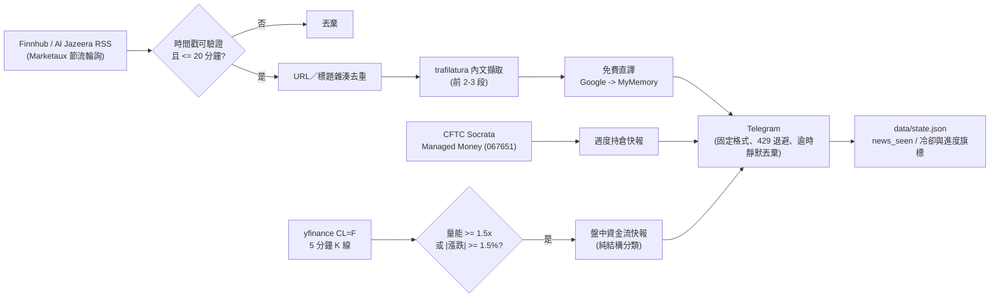

# clusdt — 原油即時新聞與資金流 Telegram 機器人

**100% 確定性管線、零 LLM**：即時新聞（嚴格時間窗＋內文爬取＋免費直譯）與
交易所／持倉資金流（yfinance 量價＋CFTC Managed Money）全部以規則與數字處理，
不呼叫任何生成式模型、不含情緒判斷或投資建議。

## 運作流程



- **零 LLM**：所有輸出皆為規則判定與直譯文字，無生成式分析、無市場偏見、無投資建議
- **嚴格時效**：時間戳無法驗證或超過 `NEWS_MAX_AGE_MINUTES` 一律丟棄
- **盤中訊號**：量價純結構分類（放量進場／放量砸盤／縮量回補／縮量拋售）

## 目錄結構

| 檔案 | 說明 |
| --- | --- |
| `main.py` | CLI 入口（once / loop / news / flow / cftc / health / ping） |
| `news_pipeline.py` | 即時新聞管線：20 分鐘窗、UTC 驗證、去重、爬取、直譯、格式化 |
| `flow_monitor.py` | 盤中資金流（CL=F 5m K 線）＋ CFTC 週度持倉（067651） |
| `telegram_dispatcher.py` | 發送層：429 退避、逾時靜默丟棄、最小發送間隔 |
| `news_sources.py` | Finnhub / Al Jazeera RSS / Marketaux 抓取與能源關鍵字過濾 |
| `cftc_data.py` | CFTC Socrata 週報 Managed Money 持倉（免金鑰） |
| `telegram_client.py` | Markdown→HTML、分段、純文字退回（被 dispatcher 繼承） |
| `pipeline.py` | 一輪完整流程（新聞 + 資金流 + CFTC） |
| `health.py` | 五條資料源健檢（Telegram / yfinance / Marketaux / Finnhub / AJ） |
| `state.py` | 去重與進度狀態（`data/state.json` 的 `news_seen` / flags） |
| `config.py` | `.env` 讀取與參數集中管理 |
| `start_bot.cmd` | Windows 一鍵啟動（循環模式） |

> **已刪除**（依零 LLM 要求清除）：`llm.py`、`prompts.py`
> 停用保留（不再被引用）：`deduplicator.py`、`price_monitor.py`、`price_metrics.py`、
> `flow_tracker.py`、`futures_data.py`

## 安裝

本專案已建立獨立虛擬環境 `.venv`（Python 3.12），如需重建：

```powershell
python -m venv .venv
.venv\Scripts\python.exe -m pip install -r requirements.txt
```

## 設定（.env）

複製 `.env.example` 為 `.env` 後填入。重要欄位：

| 變數 | 說明 |
| --- | --- |
| `TELEGRAM_BOT_TOKEN` / `TELEGRAM_CHAT_ID` | Bot 金鑰與推送目標聊天室 |
| `TELEGRAM_PROXY_URL` | Telegram 代理；本機實測直連成功，留空即可 |
| `FINNHUB_API_KEY` | 主要即時新聞源（60 次/分） |
| `MARKETAUX_API_KEY` | 補充新聞源（免費 100 次/日，以 `MARKETAUX_MIN_INTERVAL_SEC` 節流） |
| `NEWS_MAX_AGE_MINUTES` | 新聞時間窗（預設 20 分鐘，逾時丟棄） |
| `ARTICLE_PARAGRAPH_LIMIT` | 內文擷取段數（預設 3） |
| `TRANSLATE_TARGET` | 翻譯目標語言（預設 `zh-TW`） |
| `MARKETAUX_MIN_INTERVAL_SEC` | Marketaux 輪詢最小間隔秒數（預設 1800） |
| `FLOW_VOL_RATIO` | 資金流：量能倍數門檻（預設 1.5x） |
| `FLOW_MOVE_PCT` | 資金流：單根 K 線漲跌門檻 %（預設 1.5） |
| `FLOW_CANDLE_INTERVAL` | K 線週期（預設 `5m`） |
| `FLOW_ALERT_COOLDOWN_SEC` | 同一商品推播冷卻秒數（預設 900） |
| `LOOP_INTERVAL_SECONDS` | Render／`--serve` 背景輪詢間隔秒數（預設 300） |
| `CFTC_FLOW_THRESHOLD` | CFTC 推播門檻（0 = 每次新報告都推播） |
| `MAX_ALERTS_PER_RUN` | 每輪最多推播則數（預設 5） |
| `DATA_PROXY_URL` | 資料源代理；留空為直連 |
| `LOG_LEVEL` | `INFO` 較安靜；`DEBUG` 顯示完整請求日誌 |

> `DEEPSEEK_*`、`FRED_API_KEY`、`PRICE_ALERT_THRESHOLD_PCT`、`TOPIC_COOLDOWN_SECONDS`
> 為歷史 LLM 版遺留欄位，現已停用（保留於 `.env` 供備查）。

## 使用方式

```powershell
.venv\Scripts\python.exe main.py --health               # 資料源健檢（建議先跑）
.venv\Scripts\python.exe main.py --ping                 # 發送連線測試訊息
.venv\Scripts\python.exe main.py --news                 # 即時新聞掃描（20 分鐘窗 + 直譯）
.venv\Scripts\python.exe main.py --flow                 # 盤中資金流掃描（CL=F 5m K）
.venv\Scripts\python.exe main.py --cftc                 # CFTC 週度籌碼檢查
.venv\Scripts\python.exe main.py --once                 # 一輪完整掃描（新聞 + 資金流 + CFTC）
.venv\Scripts\python.exe main.py --loop --interval 300  # 常駐：每 5 分鐘一輪（建議值）
.venv\Scripts\python.exe main.py --flow --force         # 強制推播資金流快照（忽略門檻/去重）
.venv\Scripts\python.exe main.py --once --dry-run       # 只印出不發送（不更新狀態）
.venv\Scripts\python.exe main.py --serve                # 本機啟動 FastAPI + 背景輪詢（Render 模式）
```

或 `start_bot.cmd` 直接啟動循環模式。

## 部署到 Render（免費 Web Service）

1. Repo 已含 `Procfile` 與 `render.yaml`（Start Command：`uvicorn main:app --host 0.0.0.0 --port $PORT`）
2. Render Dashboard → **New → Blueprint** → 連接此 GitHub Repo → 自動建立 `clusdt-bot`
3. 於 Render 後台填入環境變數（`sync: false` 欄位）：`TELEGRAM_BOT_TOKEN`、`TELEGRAM_CHAT_ID`、`FINNHUB_API_KEY`、`MARKETAUX_API_KEY`
4. 免費方案閒置 15 分鐘會休眠 → 用 **UptimeRobot** 每 5 分鐘 GET `https://<你的服務>.onrender.com/health`
   保持喚醒（`/` 與 `/health` 皆回傳 `{"status":"ok"}`）
5. 背景輪詢在服務啟動時自動以 daemon 執行緒運行（間隔由 `LOOP_INTERVAL_SECONDS` 控制，預設 300 秒）

> ⚠️ 免費方案磁碟為臨時（ephemeral）：`data/state.json` 重新部署後會重置，去重紀錄從零開始。
> ⚠️ 請避免「本機 loop + Render」同時執行（兩邊狀態各自獨立，會造成重複推播）。

## 排程建議（Windows 工作排程器）

- 程式：`d:\github\clusdt\.venv\Scripts\python.exe`
- 引數：`main.py --once`
- 起始於：`d:\github\clusdt`
- 建議每 5–10 分鐘觸發一次；Marketaux 已有節流保護（`MARKETAUX_MIN_INTERVAL_SEC`）

## 盤中資金流模組（純數據、零 LLM）

`flow_monitor.py`（yfinance ＋ CFTC Socrata）全程以量價與持倉數字判定：

| 條件（價 × 量） | 判定 |
| --- | --- |
| 價漲 + 量能 ≥ `FLOW_VOL_RATIO` | 🟢 多頭主力放量進場（Long Buildup） |
| 價跌 + 量能 ≥ `FLOW_VOL_RATIO` | 🔴 空頭主力放量砸盤（Short Inflow） |
| 價漲 + 縮量 | ⚪ 縮量回補（Short Covering） |
| 價跌 + 縮量 | ⚪ 縮量拋售（Long Liquidation） |

- 觸發：量能 >= 5 期均量 × 1.5 **或** |單根漲跌| >= 1.5%（`FLOW_MOVE_PCT`）
- 評估基準：最新「已完成」K 線（未收完的當前 K 線自動排除）
- 防洗版：同一根 K 線僅一次 ＋ `FLOW_ALERT_COOLDOWN_SEC` 冷卻
- CFTC：僅 NYMEX WTI（合約 067651），輸出 Managed Money 多單／空單／淨持倉與週變化
- 期貨商品：`CL=F`（NYMEX WTI 主力）

## 即時新聞模組（嚴格時效、零 LLM）

- **時間戳解析（UTC 嚴格制）**：以 `python-dateutil` 解析；**僅接受帶明確時區**的
  ISO-8601／RFC 字串（如 `+02:00`／`GMT`），像 `15:11` 這種無時區裸字串一律拒收
  （避免 CEST/EDT 區域時區造成的 ±1 小時誤差）。來源欄位無效時，改爬文章 HTML 的
  `article:published_time`／`pubdate`／`<time datetime>` meta 標籤
- **時間窗**：`NEWS_MAX_AGE_MINUTES`（預設 20 分鐘），以 `datetime.now(timezone.utc)` 計算
- **顯示格式**：`🕒 發布: X 分鐘前 (HH:MM 本地時間)`（本地 = UTC+8 香港/台北時間）
- **內文擷取**：trafilatura 取前 `ARTICLE_PARAGRAPH_LIMIT` 段（含 Google News 轉址自動解析）
- **雜訊清洗**：過濾股票指標行（GF Score、P/S、P/E、市值、殖利率等）與錯誤頁文字
- **直譯**：Google 免費端點優先，失敗自動改用 MyMemory（單次 500 字元限制、長文自動分段）；
  回傳錯誤頁（Error 500 等）會被攔截並重試，全數失敗則丟棄該則
- **去重**：URL 與標題 SHA1 雜湊，持久化於 `state.json` 的 `news_seen`（保留 48 小時）

## API 額度備忘

| 服務 | 免費額度 | 本專案用量 |
| --- | --- | --- |
| Finnhub | 60 次/分 | 每輪 1 次 |
| Marketaux | 100 次/日（每次回 3 篇） | 節流後最多 1 次/30 分（約 48 次/日） |
| yfinance | 無金鑰、免費 | 每輪 1 檔（CL=F，5 分鐘 K） |
| CFTC Socrata | 無金鑰、免費 | 每輪 2 次查詢 |
| 翻譯（Google/MyMemory） | 免費端點 | 每則新聞 1–5 次呼叫；Google 失敗時自動冷卻 10 分鐘 |

## 疑難排解

| 症狀 | 處理 |
| --- | --- |
| `ProxyError ... 127.0.0.1:7890` | 代理未啟動；清空 `TELEGRAM_PROXY_URL` 改用直連（已實測可行） |
| `No module named 'pydantic_core._pydantic_core'`（或 jiter） | pip 快取安裝到錯誤平台 wheel；`pip install --force-reinstall --no-cache-dir 套件名` |
| 新聞一直沒推播 | 檢查是否真的在 `NEWS_MAX_AGE_MINUTES` 窗內；剛啟動時無新稿屬正常 |
| 標題出現「Error 500」 | 已攔截：Google 翻譯端點限流時自動冷卻 10 分鐘並改用 MyMemory |
| Telegram `can't parse entities` | 客戶端會自動退回純文字重送；仍失敗請看 log |
| Marketaux 回傳 0 則 | 檢查額度（402/429）與 `MARKETAUX_QUERIES`；週末新聞較少屬正常 |
| Finnhub `Invalid API key` | 重新申請金鑰後填入 `.env` |
| 想重複推播同一則新聞 | 刪除 `data/state.json` 對應 URL（或整個檔案） |
| 資金流未推播 | 檢查門檻（`FLOW_VOL_RATIO`／`FLOW_MOVE_PCT`）；同一根 K 線或冷卻期內也會略過 |
| CFTC 未推播 | 僅在新報告日出現在推播；若 `CFTC_FLOW_THRESHOLD` > 0 需超過門檻 |
| Render 服務休眠 | UptimeRobot 定時 GET `/health`（每 5 分鐘）；或改用付費方案 |

## 免責聲明

本工具僅供資訊彙整與研究參考；所有輸出均為公開數據與機器直譯文字，不構成任何投資建議。
投資決策應自行評估風險。
